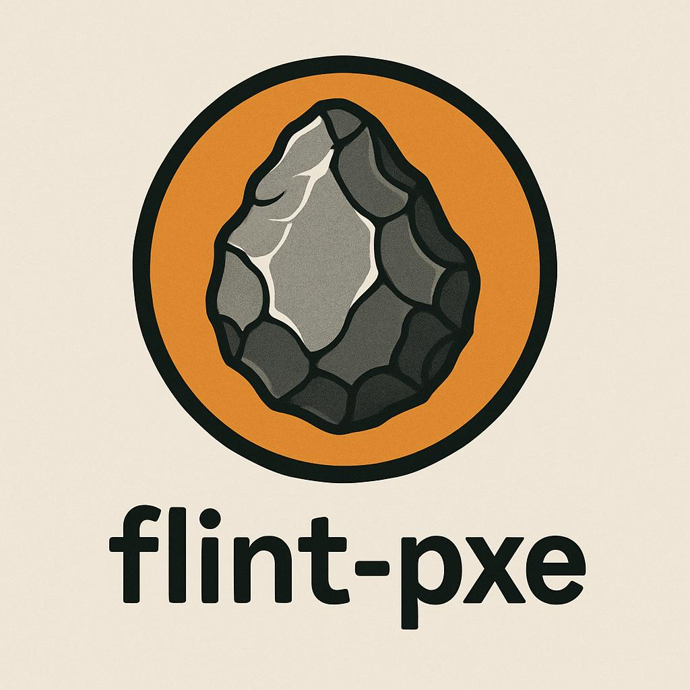

<a id="readme-top"></a>

<div align="center">
  <br />
  <a href="https://github.com/feenx-lab/flint-pxe">
    
  </a>
  <br />
  <br />

  <!-- Badges -->
  [![Contributors][contributors-shield]][contributors-url]
  [![Forks][forks-shield]][forks-url]
  [![Stars][stars-shield]][stars-url]
  [![Issues][issues-shield]][issues-url]
  [![MIT License][license-shield]][license-url]

  <p align="center">
    A lightweight Docker container bundling iPXE and dnsmasq to PXE boot Talos Linux using schematic IDs.
    <br />
    <a href="https://github.com/feenx-lab/flint-pxe"><strong>Get started</strong></a>
    &middot;
    <a href="https://github.com/feenx-lab/flint-pxe/issues/new?labels=bug&template=bug_report.md">Report Bug</a>
    &middot;
    <a href="https://github.com/feenx-lab/flint-pxe/issues/new?labels=enhancement&template=feature_request.md">Request Feature</a>
  </p>
</div>

## 📖 Table of Contents

- [Features](#features)
- [Get Started](#get-started)
- [How It Works](#how-it-works)
- [Configuration](#configuration)
- [Examples](#examples)
- [Contributing](#contributing)
- [License](#license)

## 🚀 Features

<a id="features"></a>

- Runs dnsmasq with minimal configuration
- Bundled iPXE built from source with HTTPS support
- Runs alongside your existing DHCP
- Wake-on-LAN support
- One-liner container start for bare-metal deployment
- Ideal for Talos Image Factory PXE boot workflows

## 🛠️ Get Started

<a id="get-started"></a>
To start a PXE server using the default options in your `192.168.1.0/24` subnet:
```bash
docker run -it --rm --cap-add=NET_ADMIN --net=host ghcr.io/feenx-lab/flint-pxe --network 192.168.1.0/24
```

> [!IMPORTANT]
> Make sure to run your docker host is in the same network as your Talos nodes.

###### [See more examples down below](#examples)

## 🔧 How It Works

<a id="how-it-works"></a>
This image:
- Starts a minimal `dnsmasq` DHCP proxy and TFTP server
- Uses a built-in iPXE binary (compiled from source) with HTTPS support
- Builds the url for Talos Linux iPXE boot scripts via schematic ID, arch and version
- Sends the previously built url to your machines when PXE booting
- Optionally sends a Wake-on-LAN signal to target machines

It’s meant to be a fast, ephemeral, local PXE boot solution to stand up Talos nodes.

## ⚙️ Configuration

<a id="configuration"></a>

### Required

#### Docker run parameters
- `--net=host` to allow PXE broadcasts
- `--cap-add=NET_ADMIN` for dnsmasq and WoL

#### Container command parameters:

| Flag                             | Description                                                        |
|----------------------------------|--------------------------------------------------------------------|
| `--network`, `-n`                | Subnet in CIDR notation (e.g: `192.168.1.0/24`)                    |

### Optional

#### Container command parameters:
| Flag                             | Description                                                                                                                     |
|----------------------------------|---------------------------------------------------------------------------------------------------------------------------------|
| `--arch`, `-a`                   | Architecture to use from the Image Factory (default: `amd64`)                                                                   |
| `--base-url`, `-b`               | Base URL to fetch the iPXE script from (default: `https://pxe.factory.talos.dev/pxe`)                                           |
| `--dry-run`, `-d`                | Enables test mode (dry-run, no changes applied) (default: `false`)                                                              |
| `--help`, `-h`                   | Prints help message                                                                                                             |
| `--mac-address`, `-m`            | MAC address for Wake-on-LAN. Can be used multiple times (default: none)                                                         |
| `--ipxe-url-override`, `-o`      | Override the full URL for the iPXE script (default: none)                                                                       |
| `--schematic-id`, `-s`           | The Talos Image Factory schematic ID to boot from (default: `376567988ad370138ad8b2698212367b8edcb69b5fd68c80be1f2ec7d603b4ba`) |
| `--talos-version`, `-v`          | Talos version number to use (default: `1.10.4`)                                                                                 |

## 🧪 Examples

<a id="examples"></a>

### 1. Run flint-pxe with default settings
```bash
docker run -it --rm --cap-add=NET_ADMIN --net=host \
  ghcr.io/feenx-lab/flint-pxe \
  --network 192.168.1.0/24
```

### 2. Run flint-pxe + Wake target machines

```bash
docker run -it --rm --cap-add=NET_ADMIN --net=host \
  ghcr.io/feenx-lab/flint-pxe \
  --network 192.168.1.0/24 \
  --mac-address aa:bb:cc:dd:ee:ff \
  --mac-address a1:b2:c3:d4:e5:f6
```

### 3. Run flint-pxe with a custom schematic ID on arm64

```bash
docker run -it --rm --cap-add=NET_ADMIN --net=host \
  ghcr.io/feenx-lab/flint-pxe \
  --network 192.168.1.0/24 \
  --arch arm64 \
  --schematic-id 09dbcadc567d93b02a1610c70d651fadbe56aeac3aaca36bc488a38f3fffe99d
```

## 🤝 Contributing

<a id="contributing"></a>

Contributions, issues and feature requests are welcome!
Feel free to check out the [issues page](https://github.com/feenx-lab/flint-pxe/issues) or submit a PR.

## ⚖️️ License

<a id="license"></a>

Distributed under the MIT License. See [`LICENSE`](LICENSE) for more information.

## 📦 Image Availability

| Registry | Image |
|----------|-------|
| GitHub Container Registry | `ghcr.io/feenx-lab/flint-pxe` |

> [!NOTE]
> Let us know if you'd like us to publish on Docker Hub as well by opening an issue or discussion.

<p align="right"><a href="#readme-top">⬆️Back to top</a></p>

<!-- LINKS & IMAGES -->
[relative-repo-url]: feenx-lab/flint-pxe
[contributors-shield]: https://img.shields.io/github/contributors/feenx-lab/flint-pxe.svg?style=for-the-badge
[contributors-url]: https://github.com/feenx-lab/flint-pxe/graphs/contributors
[forks-shield]: https://img.shields.io/github/forks/feenx-lab/flint-pxe.svg?style=for-the-badge
[forks-url]: https://github.com/feenx-lab/flint-pxe/network/members
[stars-shield]: https://img.shields.io/github/stars/feenx-lab/flint-pxe.svg?style=for-the-badge
[stars-url]: https://github.com/feenx-lab/flint-pxe/stargazers
[issues-shield]: https://img.shields.io/github/issues/feenx-lab/flint-pxe.svg?style=for-the-badge
[issues-url]: https://github.com/feenx-lab/flint-pxe/issues
[license-shield]: https://img.shields.io/github/license/feenx-lab/flint-pxe.svg?style=for-the-badge
[license-url]: https://github.com/feenx-lab/flint-pxe/blob/master/LICENSE.txt